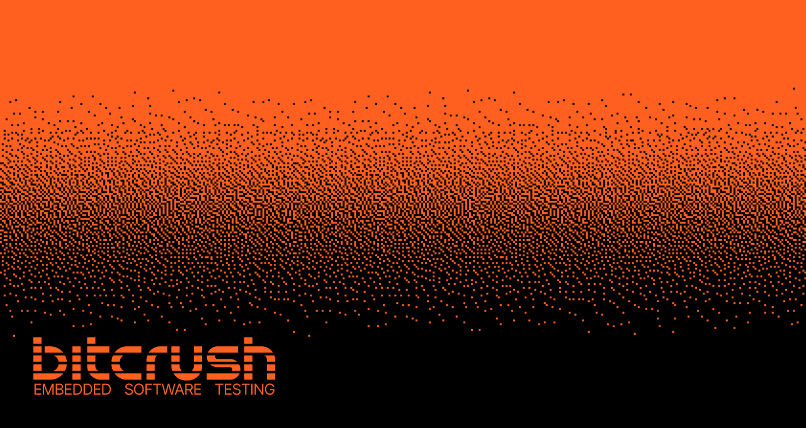

# Bitcrush - Embedded Software Testing

Welcome to Bitcrush's GitHub profile! We are dedicated to quality in embedded software. Our mission is to develop, maintain, and share state-of-the-art tools, frameworks, and best practices to ensure the highest standards of quality and reliability in embedded systems.

## About Us

At Bitcrush, we specialize in:

- **Design Tests:** Creating custom hardware and software testing solutions tailored to your product's architecture and requirements.
- **Automated Testing:** Leveraging the latest in automation technology to streamline the testing process, reduce errors, and accelerate feedback loops.
- **Continuous Integration:** Implementing CI/CD pipelines to integrate testing seamlessly into the development lifecycle, ensuring early detection of issues and higher software quality.
- **End-of-Line Testing:** Delivering robust end-of-line test setups for manufacturing environments to validate product functionality before shipment.

Our mission is to help embedded teams deliver safer, more reliable systems—faster.

## Contact Us

- **Web**: [Bitcrush Testing](https://bitcrushtesting.com)
- **Email**: [contact@bitcrushtesting.com](mailto:contact@bitcrushtesting.com)
